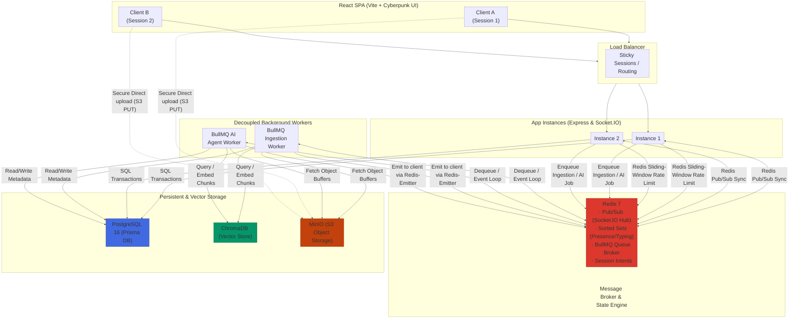

<p align="center">
  <strong>◈ SyncNexus</strong><br/>
  <em>Real-Time Collaboration & Document RAG Engine with Cyberpunk Glassmorphism UI</em>
</p>

<p align="center">
  
  
  
  
  
  
  
  
  
</p>

---

SyncNexus is a **production-grade collaborative workspace platform** featuring a **Modern Swiss Brutalism + Cyberpunk Glassmorphism** React frontend, real-time messaging across distributed servers, shared document libraries, and a **Retrieval-Augmented Generation (RAG)** AI assistant with verified document citations.

Unlike typical tutorial applications, SyncNexus implements a complete, scalable full-stack architecture — from direct-to-S3 uploads, keyset pagination, and rich GitHub Flavored Markdown rendering to distributed real-time messaging via Redis Pub/Sub and resilient background workers with exponential backoff.

The system integrates **ChromaDB** for vector storage, **BullMQ** for job processing, and **Gemini** for embedding and LLM generation, all evaluated through a robust suite of integration tests featuring **isolated test database schemas** to guarantee zero data loss during verification.

---

## Table of Contents

- [System Architecture](#system-architecture)
- [End-to-End Pipeline](#end-to-end-pipeline)
- [What Makes This Different](#what-makes-this-different)
- [Project Structure](#project-structure)
- [Setup & Installation](#setup--installation)
- [Testing & Quality](#testing--quality)
- [API Serving](#api-serving)
- [Technical Decisions](#technical-decisions)
- [Scope & Limitations](#scope--limitations)
- [Recommended Engineering Articles](#recommended-engineering-articles)

---

## System Architecture



## End-to-End Pipeline

The system follows strict, reproducible pipelines for its core asynchronous workflows:

```mermaid
flowchart LR
    A["1. Intent<br/>Presign S3 URL"] --> B["2. Upload<br/>Direct to MinIO"]
    B --> C["3. Confirm<br/>Redis Validation"]
    C --> D["4. Enqueue<br/>BullMQ Job"]
    D --> E["5. Ingest<br/>Chunk & Embed"]
    E --> F["6. Upsert<br/>ChromaDB"]
    F --> G["7. Emit<br/>Document Ready"]

    style A fill:#1e1b4b,stroke:#6366f1,color:#fff
    style B fill:#1e1b4b,stroke:#6366f1,color:#fff
    style C fill:#312e81,stroke:#818cf8,color:#fff
    style D fill:#312e81,stroke:#818cf8,color:#fff
    style E fill:#3730a3,stroke:#a5b4fc,color:#fff
    style F fill:#3730a3,stroke:#a5b4fc,color:#fff
    style G fill:#4338ca,stroke:#c7d2fe,color:#fff
```



| Workflow | Initiator | Execution | Result |
|---|---|---|---|
| **Real-Time Chat** | `message:send` over WebSocket | In-process persistence + Redis fan-out | Cross-instance delivery in < 2s |
| **Document Ingestion** | S3 Upload Confirmation | BullMQ Worker (`ingestDocument.worker.js`) | Idempotent ChromaDB embeddings |
| **AI Q&A** | `ai:ask` over WebSocket | BullMQ Worker (`aiAnswer.worker.js`) | Grounded citation response |
| **Presence/Typing** | Socket connect/disconnect | Redis Hashes / Sorted Sets | Self-expiring state (no leaks) |

---

## What Makes This Different

| Concern | Tutorial Approach | SyncNexus |
|---|---|---|
| **Multiple server instances** | In-memory connection map (breaks — messages only reach clients on the same instance) | Socket.IO Redis adapter — messages routed via Redis Pub/Sub, verified with a two-instance integration test |
| **AI citations** | LLM asked to "cite sources" — hallucinates pages and text that don't exist | Citations = metadata of chunks actually retrieved from ChromaDB, not parsed from LLM output |
| **Slow AI/embedding calls** | Awaited inline — blocks the socket, lost on client disconnect | BullMQ job queue, retried with exponential backoff (2s → 4s → 8s), worker decoupled from web tier |
| **Chat history paging** | OFFSET/LIMIT — breaks under concurrent writes (duplicates, gaps) | Cursor/keyset pagination — O(log n) per page, stable under concurrent inserts |
| **File uploads** | Buffered through the API server (multer) — holds file in Node.js memory | Presigned URLs — client uploads directly to MinIO, file bytes never touch the Node process |
| **Typing indicators** | TTL'd keys per user — stale forever if browser crashes | Redis Sorted Set with expiry scores — auto-cleans, no stale state |
| **Presence tracking** | In-memory Map — breaks with multiple instances, wrong with multiple tabs | Redis Hash per room — socketId→userId, multi-tab correct, shared across instances |
| **Rate limiting** | Per-instance in-memory counter — each instance has its own limit | Redis sliding-window — shared state, correct across all instances |
| **Vector Ingestion Retries** | Assumes absolute success on `.add()` — throws primary key errors on BullMQ retries | ChromaDB `.upsert()` inside ingestion worker ensures idempotent vector database updates |
| **Storage Key Spoofing** | Trusts arbitrary client keys on upload confirm | Redis session tracking checks that confirmation requests match keys generated by S3 presigner |
| **UI Design Aesthetics** | Generic Tailwind / Bootstrap SaaS dashboard templates | **Modern Swiss Brutalism + Cyberpunk Glassmorphism** with depth clipping watermark typography and OLED black contrast |
| **Test Database Isolation** | Running integration tests wipes out the local development database | Custom Jest global-setup hooks dynamically switch to isolated test schemas (`syncnexus_test`), preserving dev data |

---

## Project Structure

```
SyncNexus/
├── frontend/                      # React SPA (Vite + Cyberpunk Glassmorphism UI)
│   ├── src/
│   │   ├── components/            # ChatPanel, InfoPanel (AiTab, DocumentTab), RoomSidebar, UI Widgets
│   │   ├── pages/                 # LoginPage, RegisterPage, RoomPage, RoomsListPage
│   │   ├── styles/                # tokens.css, animations.css, global.css (Swiss Brutalism System)
│   │   └── contexts/              # AuthContext, SocketContext
│   ├── package.json               # Frontend dependencies (react-markdown, lucide-react, socket.io-client)
│   └── vite.config.js             # Vite build configuration
├── src/
│   ├── index.js                   # Entry point
│   ├── app.js                     # Express app factory
│   ├── socket.js                  # Socket.IO server + Redis adapter
│   ├── worker.js                  # BullMQ worker entry point (separate process)
│   ├── lib/
│   │   ├── prisma.js              # Singleton PrismaClient
│   │   ├── redis.js               # ioredis clients (main + adapter pub/sub pair)
│   │   ├── chroma.js              # ChromaDB client
│   │   ├── s3.js                  # MinIO/S3 presign helpers
│   │   ├── emitter.js             # @socket.io/redis-emitter (worker → clients)
│   │   └── errors.js              # AppError, asyncHandler, safeHandler
│   ├── middleware/
│   │   ├── auth.js                # requireAuth + socketAuth
│   │   ├── rateLimiter.js         # Redis sliding-window rate limiter
│   │   └── validate.js            # validateBody / validateEvent (Zod)
│   ├── routes/
│   │   ├── auth.routes.js         # JWT Authentication
│   │   ├── room.routes.js         # Room lifecycle
│   │   └── file.routes.js         # S3 Presigning & Confirm
│   ├── sockets/
│   │   ├── message.handlers.js    # message:send
│   │   ├── presence.handlers.js   # room:join/leave → Redis Hash
│   │   ├── typing.handlers.js     # typing:start/stop → Redis Sorted Set
│   │   └── ai.handlers.js         # ai:ask → enqueue BullMQ job
│   ├── queues/
│   │   ├── workers/
│   │   │   ├── ingestDocument.worker.js # Parse → Embed → ChromaDB
│   │   │   └── aiAnswer.worker.js       # Retrieve → LLM → Citations
│   │   ├── documentQueue.js       # Queue bindings
│   │   └── aiQueue.js             # Queue bindings
│   ├── services/
│   │   ├── message.service.js     # Cursor pagination logic
│   │   ├── file.service.js        # Redis intent session tracking
│   │   └── rag.service.js         # Chunking, Gemini embedding, vector ops
│   └── validators/index.js        # Zod schemas
├── prisma/
│   └── schema.prisma              # Relational models and composite indices
├── tests/                         # Jest Integration Suite
│   ├── global-setup.js            # Isolated test database initializer (prevents dev DB wipes)
│   ├── setup.js                   # Test environment overrides & cleanup hooks
│   ├── cross-instance.integration.test.js # Multi-instance scaling proof
│   ├── pagination.test.js                 # Concurrent-write correctness
│   ├── document-ingestion.test.js         # PDF/TXT ingestion pipeline
│   ├── ai-answer.test.js                  # AI pipeline & citations
│   ├── ai-retry.test.js                   # Backoff & failure simulation
│   └── ...
├── Dockerfile                     # Multi-stage: api + worker targets
└── docker-compose.yml             # Local infrastructure definition
```

---

## Setup & Installation

### Prerequisites
- **Node.js 20+**
- **Docker & Docker Compose**

### Step-by-Step

```powershell
# 1. Clone the repository
git clone https://github.com/yourusername/SyncNexus.git
cd SyncNexus

# 2. Configure environment variables
copy .env.example .env
# Ensure you add your GEMINI_API_KEY in the .env file

# 3. Launch Local Infrastructure (PostgreSQL, Redis, MinIO, ChromaDB)
docker compose up -d postgres redis minio chromadb

# 4. Install backend dependencies
npm install

# 5. Initialize the Database
npx prisma migrate dev

# 6. Start the API Server (Terminal 1)
npm run dev

# 7. Start the Background Worker (Terminal 2)
npm run worker

# 8. Start the React Frontend (Terminal 3)
cd frontend
npm install
npm run dev
```

---

## Testing & Quality

SyncNexus includes a comprehensive suite of integration tests validating complex distributed systems behavior.

```powershell
# Run the complete test suite
npm test

# Run isolated architectural proofs
npm test -- tests/cross-instance.integration.test.js
npm test -- tests/pagination.test.js
npm test -- tests/ai-retry.test.js
```

### Static Analysis & Banned Patterns
The codebase strictly adheres to high-performance principles. You can verify this by checking for banned patterns:

```powershell
# Should return nothing (No in-memory buffering)
grep -r "multer" src/

# Should return nothing (No leaky console logs)
grep -r "console.log" src/

# Should return nothing (No unstable OFFSET pagination)
grep -r "skip:" src/

# Should return nothing (No isolated memory-bound rate limiting)
grep -r "express-rate-limit" src/
```

---

## API Serving

### REST Endpoints
| Method | Endpoint | Auth | Description |
|---|---|---|---|
| `POST` | `/api/auth/register` | Public | Create new user, returns token pair |
| `POST` | `/api/auth/login` | Public | Authenticate user, returns token pair |
| `POST` | `/api/auth/refresh` | Public | Rotate expired access token using refresh token |
| `POST` | `/api/rooms` | Bearer | Create a new collaborative room |
| `GET` | `/api/rooms` | Bearer | List public rooms / rooms user is member of |
| `POST` | `/api/rooms/:id/join` | Bearer | Join a room |
| `GET` | `/api/rooms/:id/messages` | Bearer | Fetch cursor-paginated messages for a room |
| `POST` | `/api/rooms/:id/files/presign` | Bearer | Generate direct-to-S3 upload URL |
| `POST` | `/api/rooms/:id/files/confirm` | Bearer | Confirm S3 upload & start ingestion queue |
| `GET` | `/api/rooms/:id/documents` | Bearer | List room documents and their status |
| `GET` | `/api/rooms/:id/documents/:docId/download` | Bearer | Fetch download URL for a document |

### WebSocket Events (Namespace: `/ws`)

**Client → Server**
| Event | Payload |
|---|---|
| `room:join` | `{ roomId }` |
| `room:leave` | `{ roomId }` |
| `message:send` | `{ roomId, content }` |
| `typing:start` | `{ roomId }` |
| `typing:stop` | `{ roomId }` |
| `ai:ask` | `{ roomId, question }` |

**Server → Client**
| Event | Payload |
|---|---|
| `message:new` | `{ message }` |
| `presence:update` | `{ roomId, onlineUserIds }` |
| `typing:update` | `{ roomId, typingUserIds }` |
| `file:shared` | `{ document }` |
| `document:ready` | `{ document }` |
| `document:failed` | `{ documentId, error }` |
| `ai:answer` | `{ message }` (citations populated) |
| `ai:error` | `{ roomId, error }` |

---

## Technical Decisions

| Decision | Rationale |
|---|---|
| **Redis Adapter over In-Memory Routing** | Single Socket.IO servers isolate clients. A Redis Pub/Sub adapter guarantees messages route globally across scaled clusters. |
| **Cursor Pagination over OFFSET** | `OFFSET` shifts under concurrent inserts, causing message duplication or drops on scroll. Keyset queries `(createdAt, id)` provide stable, $O(\log N)$ performance via composite indices. |
| **Direct S3 Uploads over Multer** | Piping multi-megabyte PDFs through Express blocks the Node event loop and causes Out-Of-Memory exceptions at scale. Presigned URLs push the bandwidth cost directly to S3/MinIO. |
| **BullMQ over Inline Async/Await** | AI inference can take 2-10 seconds. Inline calls block sockets, prevent graceful retries, and lose context on disconnect. BullMQ separates work from web delivery. |
| **Idempotent ChromaDB Writes** | Replaced `.add()` with `.upsert()`. If an ingestion worker times out and retries, duplicate chunk records won't crash the database with primary key collisions. |
| **Upload Intent Validation** | Confirmation endpoints can be spoofed. Binding a 5-minute Redis TTL token to the presigned `storageKey` prevents unauthorized S3 key registrations. |
| **Early Returns for RAG** | Checking document presence *before* initiating Gemini embedding/inference prevents unneeded API calls, protecting strict usage quotas. |

---

## Scope & Limitations

> **Transparency note:** This is a portfolio project demonstrating backend engineering depth, not a production SaaS deployment.

- **Redis as SPOF.** A single Redis instance currently handles pub/sub, presence, rate limiting, and queues. At scale, this requires Redis Cluster or Sentinel.
- **Cursor Encryption.** The pagination cursor is a Base64-encoded JSON object. A malicious client could manipulate it; production requires AES encryption or MAC signing.
- **DLQ Management.** BullMQ dead-letters failed jobs after 3 attempts, but there is no automated alerting or escalation workflow integrated for system administrators.
- **Voice/Video WebRTC.** Real-time chat is implemented; real-time multimedia streaming is out of scope and requires a dedicated UDP/TURN infrastructure.
- **End-to-End Encryption.** Transport Layer Security (TLS) and JWTs secure the API, but message payloads are readable in PostgreSQL to support AI Retrieval-Augmented Generation.

---

## Recommended Engineering Articles

1. ⭐⭐⭐ **Scaling WebSockets with Redis**
   [Socket.IO Redis Adapter Documentation](https://socket.io/docs/v4/redis-adapter/)
2. ⭐⭐⭐ **Pagination Techniques**
   [Why OFFSET/LIMIT is Bad for Performance](https://use-the-index-luke.com/no-offset)
3. ⭐⭐ **Queue-Based Architectures**
   [BullMQ Patterns & Practices](https://docs.bullmq.io/patterns)
4. ⭐⭐⭐ **Retrieval-Augmented Generation**
   [Advanced RAG Techniques: Chunking and Retrieval](https://www.pinecone.io/learn/advanced-rag-techniques/)
5. ⭐⭐ **Direct-to-S3 Uploads**
   [S3 Presigned URLs for Secure File Uploads](https://aws.amazon.com/blogs/compute/uploading-to-amazon-s3-directly-from-a-web-or-mobile-application/)
6. ⭐⭐⭐ **Distributed Rate Limiting with Redis**
   [Sliding Window Rate Limiting Patterns in Distributed Systems](https://redis.io/docs/latest/develop/use/patterns/rate-limiting/)
7. ⭐⭐⭐ **Idempotency in Worker Pipelines**
   [Designing Idempotent Background Jobs & API Handlers (Stripe Engineering)](https://stripe.com/blog/idempotency)
8. ⭐⭐⭐ **Database Indexing & Cursor Pagination**
   [Evolving API Pagination at Scale (Slack Engineering Blog)](https://slack.engineering/evolving-api-pagination-at-slack/)
9. ⭐⭐ **Vector Database Fundamentals & HNSW Indexing**
   [How Vector Databases and Approximate Nearest Neighbor Search Work](https://docs.trychroma.com/guides)
10. ⭐⭐⭐ **Secure Token Authentication & Rotation**
    [Best Practices for JWT Authentication in Distributed Real-Time Systems](https://auth0.com/docs/secure/tokens/json-web-tokens/json-web-token-best-practices)

---

<p align="center">
  Built with intention by <strong>Akshansh Ranjan</strong>
</p>
